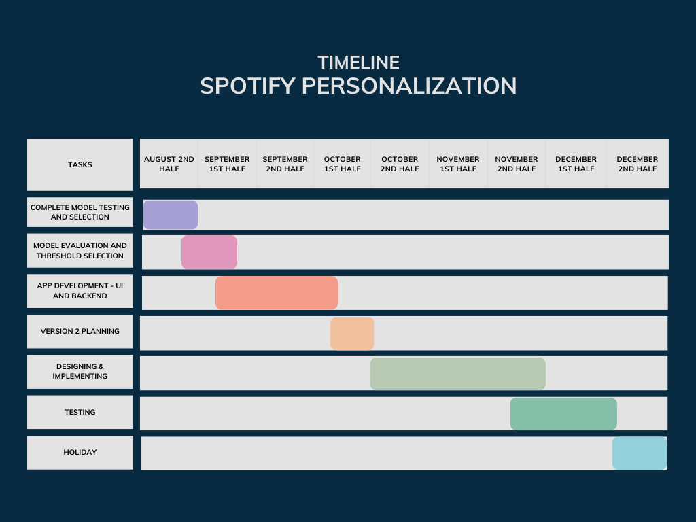

# Threshold #

1. Unsure (Belong to 2 playlist):
    Condition: Multiple songs with relatively equal percentages
                Based on entropy on the top two songs
    
2. Unsure (belong to 3 playlist):
    Condition: Multiple songs with relatively equal percentages
               Based on entropy on the top three songs

3. Very likely (only one song): 
    Condition: percentage of a song > 60%
    
4. Not belonging in any category:
    Condition: Entropy > 1
   
    
    
# Version 2 #

- Allow users to input username
- Allow them to identify their genres by grouping playlists
- Get their songs from their public playlist
- Automatically train model with xgboost cv
- Predict new songs and where it belongs to which genre.

# Timeline #

